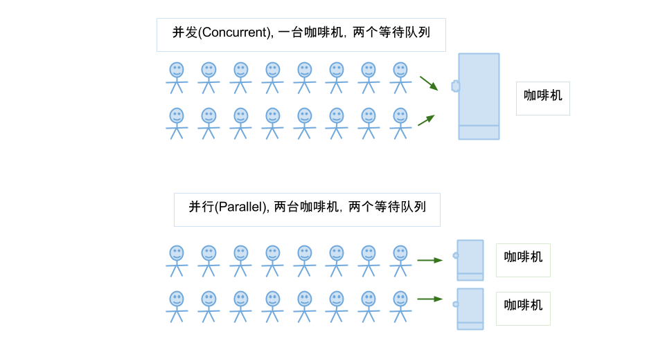

### 写在前面的话
**一直想写一个系列文章，让那些对并发编程感兴趣但又不是很熟悉的人可以看的懂，学的会，又能从原理上理解相关技术。特别像主流语言中提供的锁，条件变量，原子操作，常用并发安全的数据结构，线程池的使用及其原理都是通用的，如果能够从整体上理解这些技术，将对自己的并发编程能力打下坚实的基础。**  
我希望自己可以写一个以实例与原理相结合的系列文章，不去过多地讲特别难理解的地方，如内存模型。借助Go语言，但希望讲出来的东西是common的，在其他语言中（如C/C++/Java）也同样适用。我相信如果这些基础真正掌握了，自己再去学习内存模型，free-lock数据结构等等并不会很困难。

### 并发与并行
Go语言发明者之一 Rob Pike:
- Concurrency is not Parallelism
- Concurrency is about dealing with lots of things at once.
- Parallelism is about doing lots of things at once.

Erlang 的发明者 Joe Armstrong:

从两位大神的说法中我们可以体会到并发（Concurrency）与并发（Parallelism）的不同。一般来说并发是一个更为通用的概念，它的外延包含并发，实际上我们会提到并行的场景并不是很多，主要集中在数据并行方面，如GPU计算，大数据处理等。当然我们也没有必要把两者完全区分开来，在现在的并发编程世界中，一般两者同时存在于同一个系统中。

### 多线程与多进程
我们在设计系统时，当有多个任务需要并发处理时，多线程与多进程是我们经常会选择的两种方式。多线程的方式：轻量，线程之间的通信简单但隔离性较差，任务一个线程挂掉都有可能把整个进程弄挂掉。多进程的方式：隔离性较好，但进程之间通信成本较大。在现代大型分布式环境中，两者经常组合使用，利用进程隔离服务之间的边界，利用线程提高每个服务的响应速度。

### 协程与异步
线程相比进程来说，对系统的开销已经很小了，但其上下文切换依然会消耗许多CPU资源，所以比线程更轻量级的协程应运而生，协程本质上是一种用户态线程(区别于OS线程，内核调度器只能看到OS线程)，协程的上下文切换不需要OS内核的参与，因此开销更小。现在许多语言都或多或少的支持协程，如lua, python等等 
异步主要用在网络IO方面，借助epoll/kqueue/iocp等技术，可以高效管理大量IO连接，是现在网络IO高并发编程中必不可少的一种手段了，常见的如node.js, java的netty等等，但异步编程的方式对普通后端开发人员来说很难适应。 
有人说Go语言是为并发而生，而协程与异步编程模型又是当前高并发编程中的利器，Go语言的并发就是将这两门技术巧妙地融合到了Go的运行时系统中，即用协程取代OS线程，并实现自己的调度器来管理的协程的切换，并将epoll技术融入自己的网络库和运行时系统中，让用户用容易理解和使用的传统的同步的编程思维去处理网络IO，并享受到异步网络IO带来的高性能。详情可以参考我的这篇文章 - [Go并发机制](https://github.com/k2huang/blogpost/blob/master/golang/%E5%B9%B6%E5%8F%91%E7%BC%96%E7%A8%8B/%E5%B9%B6%E5%8F%91%E6%9C%BA%E5%88%B6/Go%E5%B9%B6%E5%8F%91%E6%9C%BA%E5%88%B6.md)。

### 并发编程的难点
1. 上下文切换带来的不确定性和对系统性能的影响
我们知道操作系统内核调度器的主要任务就是调度各个线程在CPU上运行，如果我们的程序设计的不当，有可能会造成内核调度器频繁在多个线程之间做上下文切换。如果上下文切换消耗太多CPU时间的话，线程的执行时间就会减少，从而影响性能的影响。所以线程越多不一定完成任务的速度越快（单机C10K问题），我们应该用合适数量的线程，并尽量减少线程由于锁同步，IO等待等阻塞操作而被内核调度器做上下文切换。
2. 死锁导致的系统不可用
死锁也是在并发编程中常见的问题，它属于我们的程序逻辑错误，需要及时发现并改正。死锁常常出现在多个线程在多把锁之间的争夺过程中，或对一把锁递归使用（同一线程未解锁之前又一次上锁），我们后面还会做具体的介绍。
3. 资源限制情况下如何通过并发提供资源利用率和系统高可用
这是个很大的话题，在这里只做简单的介绍。资源限制主要来源于两个方面，1.硬件资源，如cpu，内存，网络带宽等；2.软件资源，如数据连接数和socket连接数等。
如何在软硬件资源限制情况下进行并发是一个需要长期实践和优化的过程，如通过分布式突破硬件资源的限制，通过连接池解决一些软件资源的限制等等。