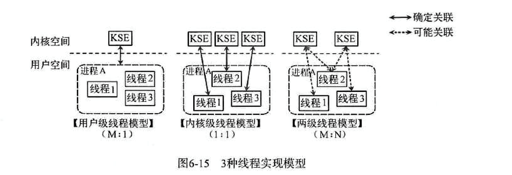

### 1. C/C++ 与 Go语言的“价值观”对照
之前看过 白明老师 在GopherChina2017的一篇演讲文章[《Go coding in go way》](http://tonybai.com/2017/04/20/go-coding-in-go-way/?hmsr=toutiao.io&utm_medium=toutiao.io&utm_source=toutiao.io)，里面提到C/C++/Go三门语言价值观，感觉很有意思，分享给大家感受一下：

C的价值观摘录
- 相信程序员：提供指针和指针运算，让C程序员天马行空的发挥
- 自己动手，丰衣足食：提供一个很小的标准库，其余的让程序员自造
- 保持语言的短小和简单
- 性能优先

C++价值观摘录
- 支持多范式，不强迫程序员使用某个特定的范式
- 不求完美，但求实用（并且立即可用）

Go价值观
 - Overall Simplicity 全面的简单
 - Orthogonal Composition 正交组合
 - Preference in Concurrency 偏好并发
 
用一句话概括Go的价值观：
Go is about orthogonal composition of simple concepts with preference in concurrency(Go是在偏好并发的环境下的简单概念/事物的正交组合).

从Go的价值观介绍可以看出 Go很适合并发编程，可以说其是为并发而生的一门语言，那它的并发机制如何？这正是这篇文章想要介绍的。

### 2. 从线程实现模型说起
线程的实现模型主要有3种：[内核级线程模型、用户级线程模型和混合型线程模型](https://en.wikipedia.org/wiki/Thread_(computing)#Models)。它们之间最大的区别在于线程与内核调度实体KSE(Kernel Scheduling Entity)之间的对应关系上。所谓的内核调度实体KSE 就是指可以被操作系统内核调度器调度的对象实体，有些地方也称其为**内核级线程**，是操作系统内核的最小调度单元。

#### 2.1 内核级线程模型
用户线程与KSE是1对1关系(1:1)。大部分编程语言的线程库(如linux的pthread，Java的java.lang.Thread，C++11的std::thread等等)都是对操作系统的线程（内核级线程）的一层封装，创建出来的每个线程与一个不同的KSE静态关联，因此其调度完全由OS调度器来做。这种方式实现简单，直接借助OS提供的线程能力，并且不同用户线程之间一般也不会相互影响。但其创建，销毁以及多个线程之间的上下文切换等操作都是直接由OS层面亲自来做，在需要使用大量线程的场景下对OS的性能影响会很大。

#### 2.2 用户级线程模型
用户线程与KSE是多对1关系(M:1)，这种线程的创建，销毁以及多个线程之间的协调等操作都是由用户自己实现的线程库来负责，对OS内核透明，一个进程中所有创建的线程都与同一个KSE在运行时动态关联。现在有许多语言实现的 **协程** 基本上都属于这种方式。这种实现方式相比内核级线程可以做的很轻量级，对系统资源的消耗会小很多，因此可以创建的数量与上下文切换所花费的代价也会小得多。但该模型有个致命的缺点，如果我们在某个用户线程上调用阻塞式系统调用(如用阻塞方式read网络IO)，那么一旦KSE因阻塞被内核调度出CPU的话，剩下的所有对应的用户线程全都会变为阻塞状态（整个进程挂起）。 <br/>
所以这些语言的**协程库**会把自己一些阻塞的操作重新封装为完全的非阻塞形式，然后在以前要阻塞的点上，主动让出自己，并通过某种方式通知或唤醒其他待执行的用户线程在该KSE上运行，从而避免了内核调度器由于KSE阻塞而做上下文切换，这样整个进程也不会被阻塞了。

#### 2.3 混合型线程模型
用户线程与KSE是多对多关系(M:N), 这种实现综合了前两种模型的优点，为一个进程中创建多个KSE，并且线程可以与不同的KSE在运行时进行动态关联，当某个KSE由于其上工作的线程的阻塞操作被内核调度出CPU时，当前与其关联的其余用户线程可以重新与其他KSE建立关联关系。当然这种动态关联机制的实现很复杂，也需要用户自己去实现，这算是它的一个缺点吧。Go语言中的并发就是使用的这种实现方式，Go为了实现该模型自己实现了一个运行时调度器来负责Go中的"线程"与KSE的动态关联。此模型有时也被称为 **两级线程模型**，**即用户调度器实现用户线程到KSE的“调度”，内核调度器实现KSE到CPU上的调度**。<br/>

三种模型的示意图如下:

### 3. Go并发调度: G-P-M模型
#### 3.1 G-P-M模型
有了上面的认识，我们可以开始真正的介绍Go的并发机制了，先用一段代码展示一下在Go语言中新建一个“线程”(Go语言中称为Goroutine)的样子：
```go
// 用go关键字加上一个函数（这里用了匿名函数）
// 调用就做到了在一个新的“线程”并发执行任务
go func() { 
    // do something in one new goroutine
}()
```
功能上等价于Java8的代码:
```java
new java.lang.Thread(() -> { 
    // do something in one new thread
}).start();
```
可以看到Go的并发用起来非常简单，用了一个语法糖将内部复杂的实现结结实实的包装了起来。其内部可以用下面这张图来概述：

其图中的G, P和M都是Go语言运行时系统（其中包括内存分配器，并发调度器，垃圾收集器等组件，可以想象为Java中的JVM）抽象出来概念和数据结构对象：<br/>
G：Goroutine的简称，上面用go关键字加函数调用的代码就是创建了一个G对象，是对一个要并发执行的任务的封装，也可以称作用户态线程。属于用户级资源，对OS透明，具备轻量级，可以大量创建，上下文切换成本低等特点。<br/>
M：Machine的简称，在linux平台上是用clone系统调用创建的，其与用linux pthread库创建出来的线程本质上是一样的，都是利用系统调用创建出来的OS线程实体。M的作用就是执行G中包装的并发任务。**Go运行时系统中的调度器的主要职责就是将G公平合理的安排到多个M上去执行**。其属于OS资源，可创建的数量上也受限了OS，通常情况下G的数量都多于活跃的M的。<br/>
P：Processor的简称，逻辑处理器，主要作用是管理G对象（每个P都有一个G队列），并为G在M上的运行提供本地化资源。<br/>
从2.3节介绍的两级线程模型来看，似乎并不需要P的参与，有G和M就可以了，那为什么要加入P这个东东呢？<br/>
其实Go语言运行时系统早期(Go1.0)的实现中并没有P的概念，Go中的调度器直接将G分配到合适的M上运行。但这样带来了很多问题，例如，不同的G在不同的M上并发运行时可能都需向系统申请资源（如堆内存），由于资源是全局的，将会由于资源竞争造成很多系统性能损耗，为了解决类似的问题，后面的Go（Go1.1）运行时系统加入了P，让P去管理G对象，M要想运行G必须先与一个P绑定，然后才能运行该P管理的G。这样带来的好处是，我们可以在P对象中预先申请一些系统资源（本地资源），G需要的时候先向自己的本地P申请（无需锁保护），如果不够用或没有再向全局申请，而且从全局拿的时候会多拿一部分，以供后面高效的使用。就像现在我们去政府办事情一样，先去本地政府看能搞定不，如果搞不定再去中央，从而提供办事效率。<br/>
而且由于P解耦了G和M对象，这样即使M由于被其上正在运行的G阻塞住，其余与该M关联的G也可以随着P一起迁移到别的活跃的M上继续运行，从而让G总能及时找到M并运行自己，从而提高系统的并发能力。<br/>
Go运行时系统通过构造G-P-M对象模型实现了一套用户态的并发调度系统，可以自己管理和调度自己的并发任务，所以可以说Go语言**原生支持并发**。**自己实现的调度器负责将并发任务分配到不同的内核线程上运行，然后内核调度器接管内核线程在CPU上的执行与调度。**

#### 3.2 调度过程
Go运行时完整的调度系统是很复杂，很难用一篇文章描述的清楚，这里只能从宏观上介绍一下，让大家有个整体的认识。
```go
// Goroutine1
func task1() {
    go task2()
    go task3()
}
```
假如我们有一个G(Goroutine1)已经通过P被安排到了一个M上正在执行，在Goroutine1执行的过程中我们又创建两个G，这两个G会被马上放入与Goroutine1相同的P的本地G任务队列中，排队等待与该P绑定的M的执行，这是最基本的结构，很好理解。 关键问题是:<br/> 
**a.如何在一个多核心系统上尽量合理分配G到多个M上运行，充分利用多核，提高并发能力呢？**<br/>如果我们在一个Goroutine中通过**go**关键字创建了大量G，这些G虽然暂时会被放在同一个队列, 但如果这时还有空闲P（系统内P的数量默认等于系统cpu核心数），Go运行时系统始终能保证至少有一个（通常也只有一个）活跃的M与空闲P绑定去各种G队列去寻找可运行的G任务，该种M称为**自旋的M**。一般寻找顺序为：自己绑定的P的队列，全局队列，然后其他P队列。如果自己P队列找到就拿出来开始运行，否则去全局队列看看，由于全局队列需要锁保护，如果里面有很多任务，会转移一批到本地P队列中，避免每次都去竞争锁。如果全局队列还是没有，就要开始玩狠的了，直接从其他P队列偷任务了（偷一半任务回来）。这样就保证了在还有可运行的G任务的情况下，总有与CPU核心数相等的M+P组合 在执行G任务或在执行G的路上(寻找G任务)。<br/>
**b. 如果某个M在执行G的过程中被G中的系统调用阻塞了，怎么办？**<br/>
在这种情况下，这个M将会被内核调度器调度出CPU并处于阻塞状态，与该M关联的其他G就没有办法继续执行了，但Go运行时系统的一个监控线程(sysmon线程)能探测到这样的M，并把与该M绑定的P剥离，寻找其他空闲或新建M接管该P，然后继续运行其中的G，大致过程如下图所示。然后等到该M从阻塞状态恢复，需要重新找一个空闲P来继续执行原来的G，如果这时系统正好没有空闲的P，就把原来的G放到全局队列当中，等待其他M+P组合发掘并执行。<br/>
<br/>
**c. 如果某一个G在M运行时间过长，有没有办法做抢占式调度，让该M上的其他G获得一定的运行时间，以保证调度系统的公平性?**<br/>
我们知道linux的内核调度器主要是基于时间片和优先级做调度的。对于相同优先级的线程，内核调度器会尽量保证每个线程都能获得一定的执行时间。为了防止有些线程"饿死"的情况，内核调度器会发起抢占式调度将长期运行的线程中断并让出CPU资源，让其他线程获得执行机会。当然在Go的运行时调度器中也有类似的抢占机制，但并不能保证抢占能成功，因为Go运行时系统并没有内核调度器的中断能力，它只能通过向运行时间过长的G中设置抢占flag的方法温柔的让运行的G自己主动让出M的执行权。 <br/>
说到这里就不得不提一下Goroutine在运行过程中可以动态扩展自己线程栈的能力，可以从初始的2KB大小扩展到最大1G（64bit系统上），因此在每次调用函数之前需要先计算该函数调用需要的栈空间大小，然后按需扩展（超过最大值将导致运行时异常）。Go抢占式调度的机制就是利用在判断要不要扩栈的时候顺便查看以下自己的抢占flag，决定是否继续执行，还是让出自己。<br/>
运行时系统的监控线程会计时并设置抢占flag到运行时间过长的G，然后G在有函数调用的时候会检查该抢占flag，如果已设置就将自己放入全局队列，这样该M上关联的其他G就有机会执行了。但如果正在执行的G是个很耗时的操作且没有任何函数调用(如只是for循环中的计算操作)，即使抢占flag已经被设置，该G还是将一直霸占着当前M直到执行完自己的任务。

### 4. Goroutine与Channel: 锁之外的另一种同步机制
在主流的编程语言中为了保证多线程之间共享数据安全性和一致性，都会提供一套基本的同步工具集，如锁，条件变量，原子操作等等。Go语言标准库也毫不意外的提供了这些同步机制，使用方式也和其他语言也差不多。<br/>
除了这些基本的同步手段，Go语言还提供了一种新的同步机制: Channel，它在Go语言中是一个像int, float32等的基本类型，一个channel可以认为是一个能够在多个Goroutine之间传递某一类型的数据的管道。Go中的channel无论是实现机制还是使用场景都和Java中的BlockingQueue很接近。<br/><br/>
**使用方式**
```go
// 声明channel变量
var syncChan = make(chan int)  // 无缓冲channel，主要用于两个Goroutine之间建立同步点
var cacheChan = make(chan int, 10)  // 缓冲channel
// 向channel中写入数据
syncChan <- 1
cacheChan <- 1
// 从channel读取数据
var i = <-syncChan
var j = <-cacheChan
```
几乎等价于的Java中的操作:
```java
TransferQueue<Integer> syncQueue = new LinkedTransferQueue<Integer>();
BlockingQueue<Integer> cacheQueue = new ArrayBlockingQueue<Integer>(10); 

syncQueue.transfer(1);
cacheQueue.put(1);

int i = syncQueue.take();
int j = cacheQueu.take();
```
**使用场景**<br/>
a. 与Java的BlockingQueue一样用在需要生产者消费者模型的并发环境中。<br/>
b. 锁同步场景下一种替代方案。在Go的并发编程中有一句很经典的话：[不要以共享内存的方式去通信，而要以通信的方式去共享内存](https://golang.org/doc/effective_go.html#concurrency)。在Go语言中并不鼓励用锁保护共享状态的方式在不同的Goroutine中分享信息(以共享内存的方式去通信)。而是鼓励通过channel将共享状态或共享状态的变化在各个Goroutine之间传递（以通信的方式去共享内存），这样同样能像用锁一样保证在同一的时间只有一个Goroutine访问共享状态。但这的确需要转换以前用锁做并发同步的思维方式，大家觉得那种适合自己和自己的使用场景就用哪种好了，并不能很简单、绝对地说哪种方式更好，更高效。

### 5. Go语言对网络IO的优化
在谈论高性能网络IO编程时，我们几乎都离不开epoll/kqueue/iocp等技术术语了，如Java最新的的NIO，Node等等的高性能网络IO模型都是基于这些技术实现的。诞生于21世纪，有**互联网时代的C语言**之称的Go语言，这么重视高并发，当然不会放过对网络的优化。且Go语言中对网络IO的优化很巧妙，让你可以用和以前一样的(同步的)思维方式去编程的同时（而不是反人类的异步方式），还能享受到与异步方式几乎同等高效的运行性能。那Go语言中是如何做的呢？主要是从两方面下手的：<br/>
a. 将标准库中的网络库全部封装为非阻塞形式，防止其阻塞底层的M并导致内核调度器切换上下文带来的系统开销。<br/>
b. 运行时系统加入epoll机制(针对Linux系统)，当某一个Goroutine在进行网络IO操作时，如果网络IO未就绪，就将其该Goroutine封装一下，放入epoll的等待队列中，当前G挂起，与其关联的M可以继续运行其他G。当相应的网络IO就绪后，Go运行时系统会将等待网络IO就绪的G从epoll就绪队列中取出（主要在两个地方从epoll中获取已网络IO就绪的G列表，一是sysmon监控线程中，二是自旋的M中），再由调度器将它们像普通的G一样分配给各个M去执行。<br/>
Go语言将高性能网络IO的实现方式直接集成到了Go本身的运行时系统中，与Go的并发调度系统协同高效的工作，让开发人员可以简单，高效地进行网络编程。

### 6. 总结
Go语言并不完美，它是[以软件工程为目的的语言设计](http://blog.jobbole.com/36480/)。其实现的并发机制也并不是什么革新的技术，只是将这些经典的理论和技术以一种简洁高效的方式组合了起来，并用简单抽象的API或语法糖开放给开发人员，着实减轻了开发人员编程的心智负担。而且其通过引入channel机制，将另一种并发编程模型(CSP: 通信顺序进程)带给了我们，给我们提供了使用其他并发编程思维方式的机会(有关CSP模型建议大家看看《七周七并发模型》这本书的第六章)，Goroutine与Channel的组合是一对很有powerful的并发工具，相信其可以给你带了更好的并发编程体验。

### 7. 参考
《Go并发编程实战》 第2版<br/>
《Go语言学习笔记》<br/>
[也谈goroutine调度器](http://tonybai.com/2017/06/23/an-intro-about-goroutine-scheduler/)<br/>
[Go coding in go way](http://tonybai.com/2017/04/20/go-coding-in-go-way/?hmsr=toutiao.io&utm_medium=toutiao.io&utm_source=toutiao.io)<br/>
